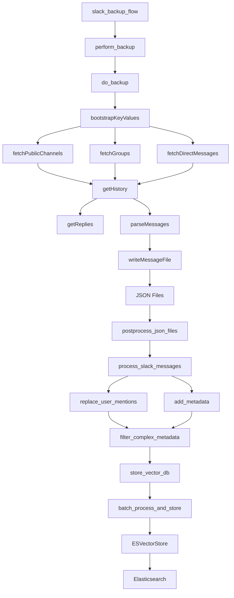
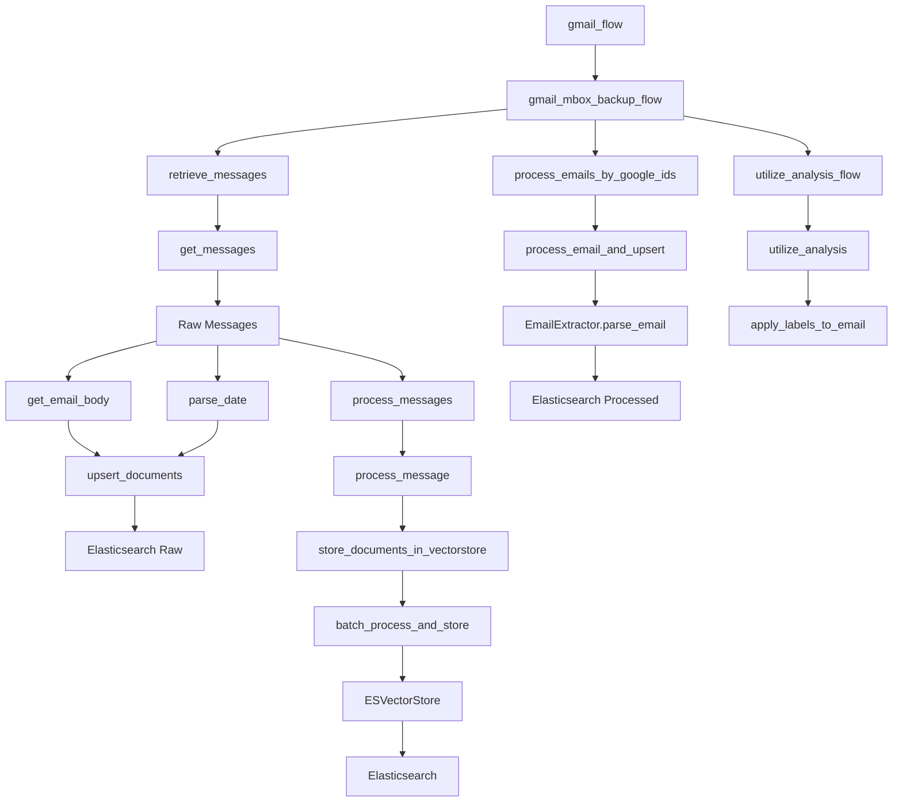
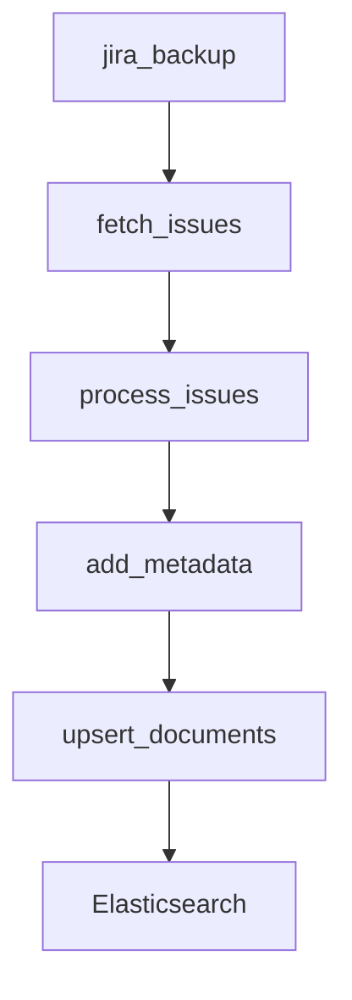
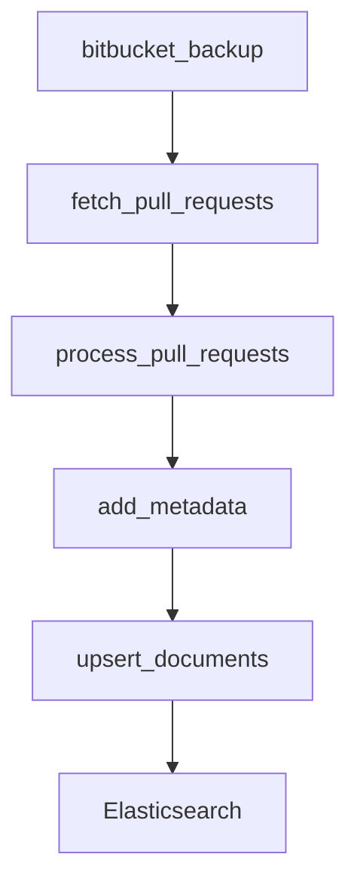
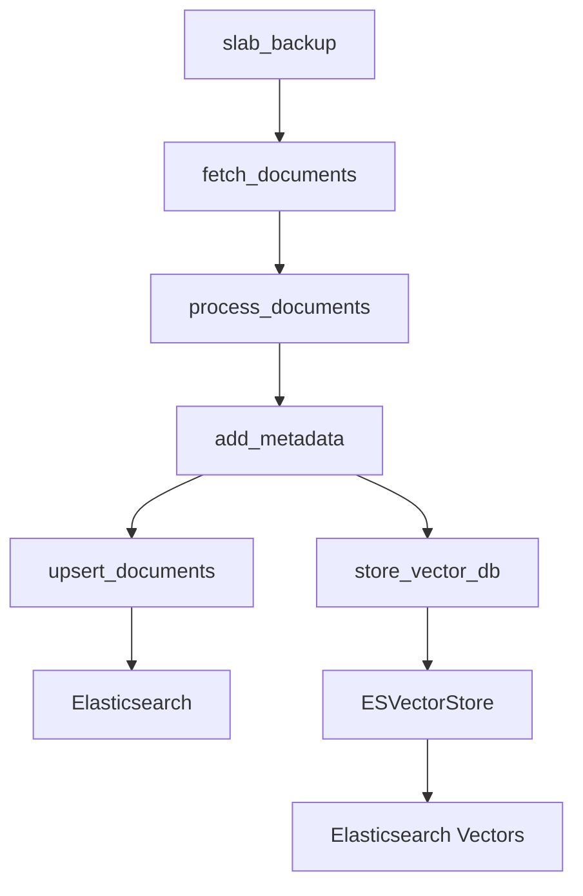
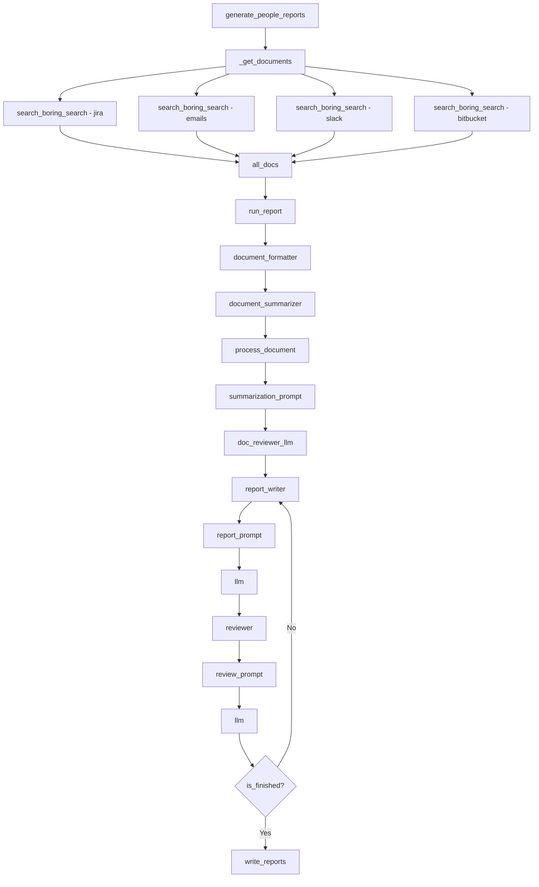
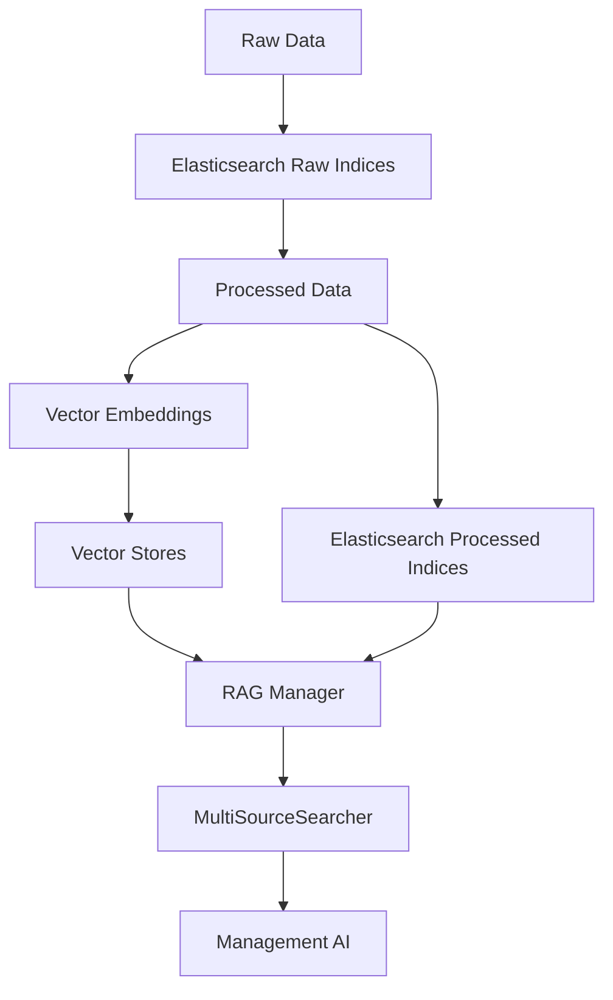
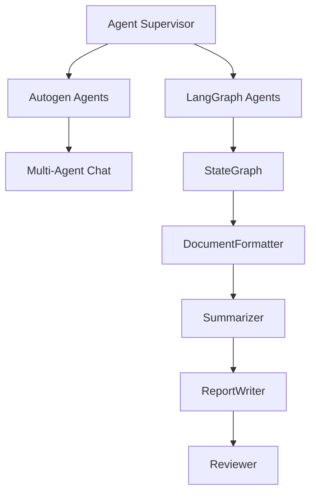
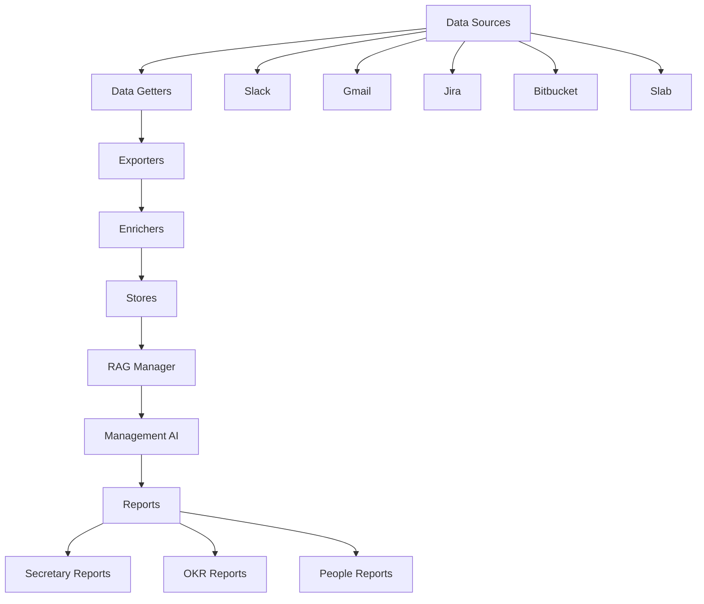

# Detailed Data Flow Analysis

This document provides a more detailed analysis of how data flows through the system, focusing on the specific transformations and processing steps for each data source.

## 1. Slack Data Flow

### Key Slack Processing Steps:
1. **Collection**: The system authenticates with Slack and collects messages from public channels, private groups, and direct messages
2. **History Retrieval**: For each channel/group/DM, it retrieves the message history and thread replies
3. **Message Parsing**: Messages are parsed and written to JSON files organized by date
4. **Post-processing**: JSON files are post-processed to add metadata like usernames and channel names
5. **Storage**: Processed messages are stored in Elasticsearch with vector embeddings

## 2. Gmail Data Flow

### Key Gmail Processing Steps:
1. **Collection**: The system retrieves Gmail messages from a specified time period
2. **Raw Storage**: Raw messages are stored in Elasticsearch with minimal processing
3. **Processing**: Messages are processed to extract bodies, parse dates, and add metadata
4. **LLM Analysis**: Emails are analyzed using LLMs to extract key information
5. **Labeling**: Based on the analysis, emails are labeled for better organization
6. **Vector Storage**: Processed emails are stored with vector embeddings for retrieval

## 3. Jira Data Flow

## 4. Bitbucket Data Flow

## 5. Slab Data Flow

## 6. Reporting Flow

### Key Reporting Steps:
1. **Document Retrieval**: The system retrieves relevant documents from various sources
2. **Document Formatting**: Documents are formatted for processing
3. **Summarization**: Documents are summarized to extract key information
4. **Report Writing**: A report is generated based on the summarized documents
5. **Review**: The report is reviewed for quality
6. **Finalization**: If the report passes review, it is finalized and saved

## 7. Data Store Architecture

### Key Data Store Components:
1. **Raw Indices**: Store raw data from various sources
2. **Processed Indices**: Store processed and enriched data
3. **Vector Stores**: Store vector embeddings for similarity search
4. **RAG Manager**: Manages retrieval-augmented generation across multiple sources
5. **MultiSourceSearcher**: Provides a unified interface for searching across all data sources

## 8. Agent Architecture

### Key Agent Components:
1. **Agent Supervisor**: Coordinates agent activities
2. **Autogen Agents**: Implements multi-agent conversations
3. **LangGraph Agents**: Implements graph-based agent workflows
4. **StateGraph**: Manages state transitions in agent workflows
5. **Specialized Nodes**: Handle specific tasks in the workflow (formatting, summarizing, writing, reviewing)

## 9. End-to-End Data Flow

This detailed data flow analysis provides a comprehensive view of how data moves through the system, from collection to reporting, highlighting the specific transformations and processing steps for each data source.