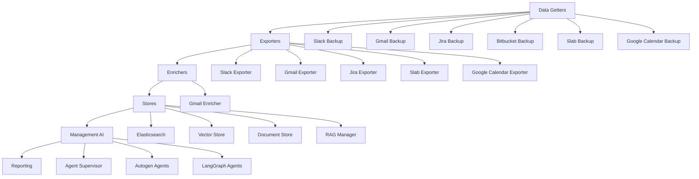
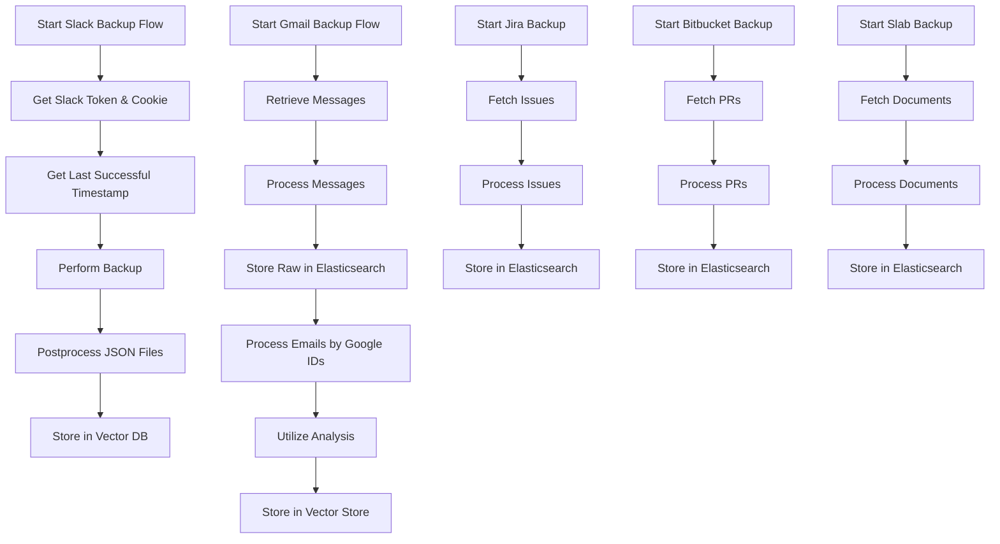
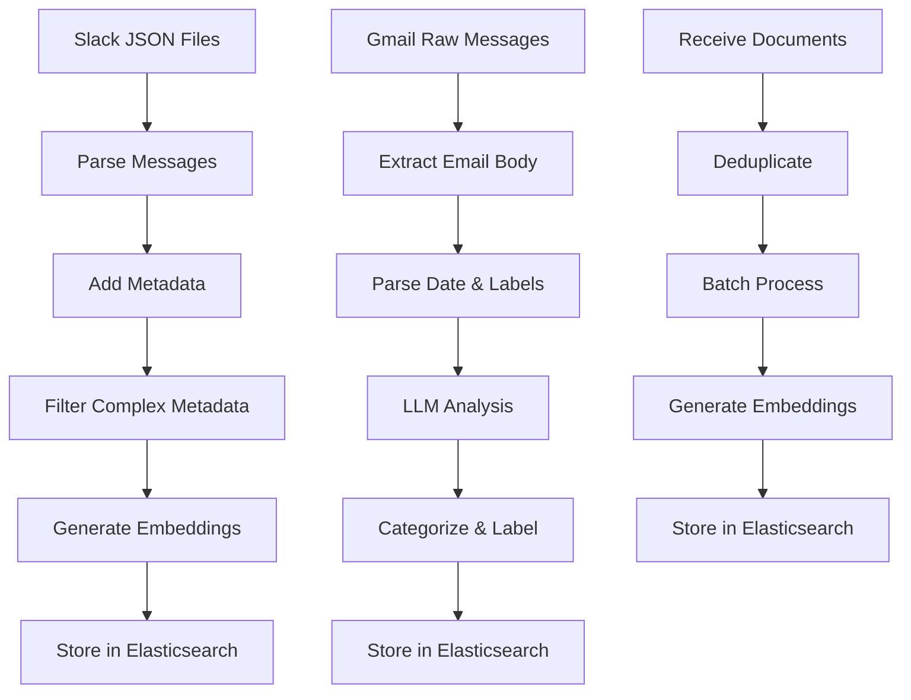
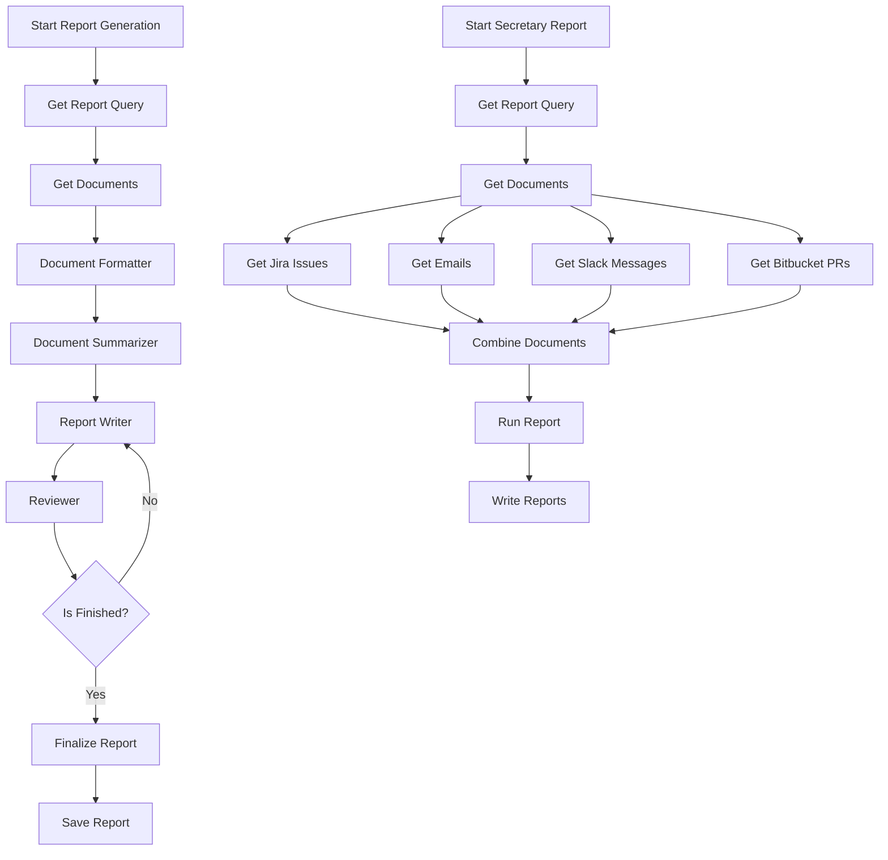
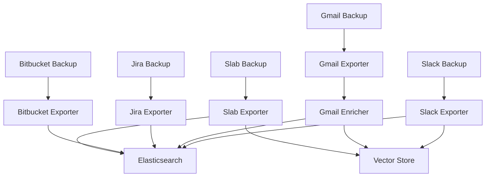
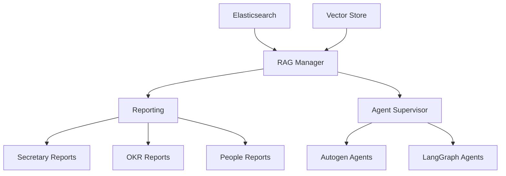

# Flow Diagram of Actions in the Prefect Data Getters System

## Overview

This diagram illustrates the data flow through the system, from data collection to reporting. The system is organized into several key components:

1. **Data Getters**: Collect data from various sources
2. **Exporters**: Process and format the collected data
3. **Enrichers**: Enhance the data with additional information
4. **Stores**: Store the processed data
5. **Management AI**: Generate reports and insights from the stored data

## Detailed Data Flow

### 1. Data Collection Flow

### 2. Data Processing Flow

### 3. Reporting Flow

## Component Interactions

### Data Getters to Stores

### Stores to Management AI

## Key Processes

1. **Data Collection**: The system collects data from various sources (Slack, Gmail, Jira, Bitbucket, Slab, Google Calendar)
2. **Data Processing**: The collected data is processed and formatted
3. **Data Enrichment**: The processed data is enriched with additional information (especially for Gmail)
4. **Data Storage**: The enriched data is stored in Elasticsearch and Vector Stores
5. **Report Generation**: Reports are generated from the stored data using LLMs and agent frameworks
6. **Agent Interaction**: Various agent frameworks (Autogen, LangGraph) are used to interact with the data

This flow diagram provides a comprehensive overview of all the actions taken in the src directory, showing how data flows through the system from collection to reporting.