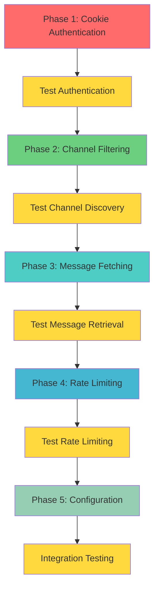

# Slack Exporter Drift Analysis and Fix Plan

## Overview

This document analyzes the functional differences between the current [`slack_exporter.py`](../src/prefect_data_getters/exporters/slack_exporter.py) and the original [`slack_backup.py`](../src/prefect_data_getters/exporters/slack/slack_backup.py), identifying where the current implementation has drifted from the original logic and providing a comprehensive plan to fix these issues.

## Critical Issue: Authentication Failure

### Problem
The current [`SlackExporter`](../src/prefect_data_getters/exporters/slack_exporter.py#L172) only passes the token to the Slacker client:
```python
self._slack_client = Slacker(self.config['token'])
```

### Original Working Logic
The [`slack_backup.py`](../src/prefect_data_getters/exporters/slack/slack_backup.py#L549-550) properly handles cookies for authentication:
```python
cookie_header = {'cookie': cookie} if cookie else {}
slack = Slacker(headers=cookie_header, token=token)
```

### Impact
**Authentication fails because cookies are required for certain Slack API operations**, especially when accessing private channels or when the workspace has specific security requirements.

## Detailed Functional Differences

### 1. Authentication & Headers
| Aspect | Current Implementation | Original Implementation | Impact |
|--------|----------------------|------------------------|---------|
| **Cookie Support** | ❌ Missing | ✅ Supported via headers | **CRITICAL: Auth failures** |
| **Header Passing** | ❌ Not implemented | ✅ Full header support | **HIGH: Limited API access** |

### 2. Channel Filtering Logic
| Aspect | Current Implementation | Original Implementation | Impact |
|--------|----------------------|------------------------|---------|
| **Group DM Filtering** | Basic member check | Complex logic with timestamp filtering | **MEDIUM: May include stale chats** |
| **Stale Chat Cutoff** | ❌ Missing | 31-day cutoff for large group DMs | **MEDIUM: Performance impact** |
| **Member Count Logic** | ❌ Missing | Different rules for 1:1 vs group DMs | **LOW: Minor filtering differences** |

**Original Complex Filtering Logic:**
```python
groups = list(filter(
    lambda obj: (
        obj["is_member"] and (
            (not obj.get("is_mpim", False)) or
            (obj["is_mpim"] and obj["num_members"] > 3 and obj["updated"] > oldestTimestamp*1000 - timedelta(days=31).total_seconds()*1000) or
            (obj["is_mpim"] and obj["num_members"] <= 3)
        )
    ),
    groups
))
```

### 3. Message Fetching Strategy
| Aspect | Current Implementation | Original Implementation | Impact |
|--------|----------------------|------------------------|---------|
| **Thread Handling** | Separate fetch after main messages | Inline fetch during message processing | **MEDIUM: Potential ordering issues** |
| **Infinite Loop Protection** | Basic pagination | Advanced timestamp comparison | **HIGH: Risk of infinite loops** |
| **Rate Limit Handling** | Fixed delays | Dynamic `Retry-After` header values | **MEDIUM: Suboptimal performance** |

**Original Infinite Loop Protection:**
```python
if lastTimestamp == lastTimestampFromPreviousIteration:
    minTimestamp = float(lastTimestamp)
    for m in messages:
        if minTimestamp > float(m['ts']):
            minTimestamp = float(m['ts'])
    
    if minTimestamp == lastTimestamp:
        print("warning: lastTimestamp is not changing.  infinite loop?")
    lastTimestamp = minTimestamp
```

### 4. Error Handling & Rate Limiting
| Aspect | Current Implementation | Original Implementation | Impact |
|--------|----------------------|------------------------|---------|
| **Rate Limit Response** | Fixed 2-second wait | Uses actual `Retry-After` header | **MEDIUM: Inefficient rate limiting** |
| **HTTP Error Handling** | Generic exception handling | Specific 429 status code handling | **LOW: Less precise error handling** |

## Implementation Plan

### Phase 1: Critical Authentication Fix (Priority: CRITICAL)
**Objective:** Restore cookie-based authentication to fix auth failures

#### Changes Required:
1. **Update SlackExporter.__init__():**
   ```python
   def __init__(self, config: Optional[Dict[str, Any]] = None):
       super().__init__(config)
       self._validate_config(['token'])
       # Add cookie support
       self.config.setdefault("cookie", None)  # New
   ```

2. **Update _get_slack_client():**
   ```python
   def _get_slack_client(self):
       if self._slack_client is None:
           # Build headers with cookie support
           headers = {}
           if self.config.get('cookie'):
               headers['cookie'] = self.config['cookie']
           
           self._slack_client = Slacker(
               token=self.config['token'],
               headers=headers if headers else None  # New
           )
   ```

3. **Update slack_flow.py:**
   ```python
   @task
   def fetch_slack_messages(token: str, cookie: str = None, days_ago: int = 7, channels: List[str] = None):
       config = {"token": token}
       if cookie:
           config["cookie"] = cookie  # New
       slack_exporter = SlackExporter(config)
   ```

### Phase 2: Channel Filtering Enhancement (Priority: HIGH)
**Objective:** Implement sophisticated group DM filtering logic

#### Changes Required:
1. **Update _get_channels_to_process():**
   - Add timestamp-based filtering for group DMs
   - Implement member count logic
   - Add 31-day cutoff for stale large group chats

### Phase 3: Message Fetching Improvements (Priority: MEDIUM)
**Objective:** Improve thread handling and add infinite loop protection

#### Changes Required:
1. **Enhance _fetch_channel_messages():**
   - Move thread reply fetching inline
   - Add infinite loop detection
   - Implement timestamp comparison logic

2. **Update _fetch_thread_replies():**
   - Add same infinite loop protection
   - Ensure proper deduplication

### Phase 4: Rate Limiting Improvements (Priority: MEDIUM)
**Objective:** Use dynamic rate limiting based on actual API responses

#### Changes Required:
1. **Update rate limit handling:**
   - Parse `Retry-After` headers
   - Implement dynamic wait times
   - Maintain backward compatibility

### Phase 5: Configuration Updates (Priority: LOW)
**Objective:** Update flow and configuration to support new parameters

#### Changes Required:
1. **Update Prefect flow:**
   - Add cookie secret retrieval
   - Update task signatures
   - Add proper error handling

2. **Update documentation:**
   - Document new cookie parameter
   - Update deployment instructions

## Implementation Sequence



## Risk Assessment

| Risk | Probability | Impact | Mitigation |
|------|-------------|---------|------------|
| **Auth still fails after cookie fix** | Low | Critical | Test with multiple workspace types |
| **Breaking existing deployments** | Medium | High | Maintain backward compatibility |
| **Performance regression** | Low | Medium | Benchmark before/after changes |
| **Missing edge cases** | Medium | Medium | Comprehensive testing with various channel types |

## Testing Strategy

### Unit Tests
- [ ] Test cookie header passing
- [ ] Test channel filtering logic
- [ ] Test infinite loop protection
- [ ] Test rate limiting behavior

### Integration Tests
- [ ] Test with real Slack workspace
- [ ] Test with different channel types
- [ ] Test with large message volumes
- [ ] Test rate limiting scenarios

### Regression Tests
- [ ] Ensure existing functionality still works
- [ ] Verify document output format unchanged
- [ ] Test backward compatibility

## Success Criteria

1. **Authentication works** with cookie-enabled workspaces
2. **All channel types** are properly filtered and accessed
3. **No infinite loops** during message fetching
4. **Rate limiting** respects API response headers
5. **Backward compatibility** maintained for existing deployments
6. **Performance** is equal or better than original implementation

## Next Steps

1. **Immediate:** Implement Phase 1 (Cookie Authentication)
2. **Short-term:** Complete Phases 2-3 (Channel Filtering & Message Fetching)
3. **Medium-term:** Implement Phases 4-5 (Rate Limiting & Configuration)
4. **Long-term:** Consider additional features from original implementation (file downloads, interactive prompts)

---

*This analysis was generated by comparing the current SlackExporter implementation with the original slack_backup.py functionality to identify and address functional drift.*